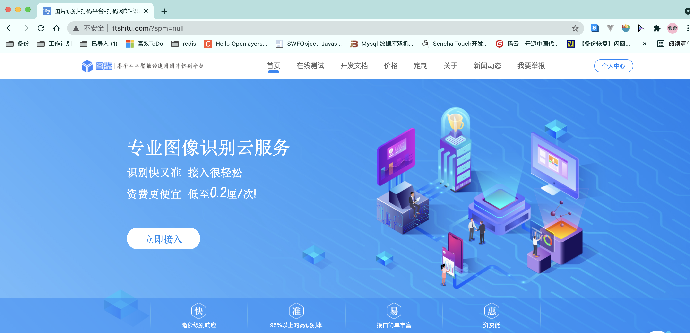
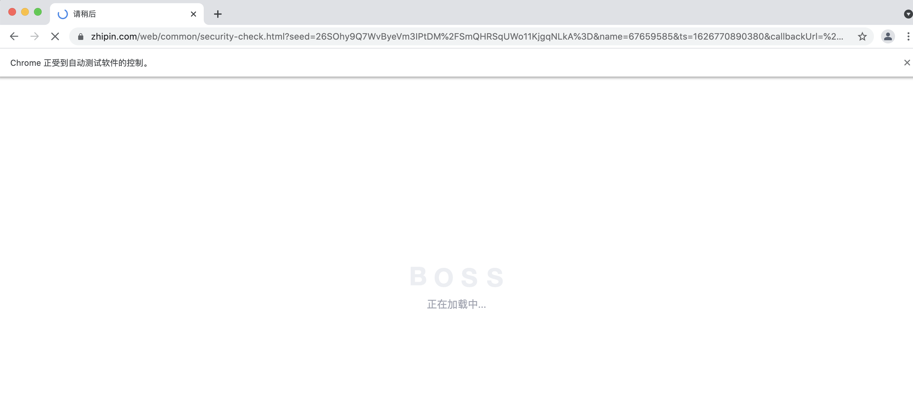
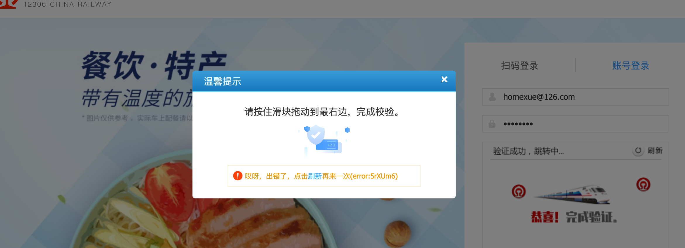

# selenium小进阶+案例

## 关于验证码

验证码处理: 

	1. 直接把浏览器里面的cookie拿出来直接用. 
 	2. 手动编写验证码识别的功能(深度学习)
 	3. 第三方打码平台(收费), 超级鹰, 图鉴

上一节, 我们聊过关于验证码的问题. 本节继续. 

图鉴-好东西http://www.ttshitu.com/



这个东西. 既便宜. 有好用. 比超级鹰爽. 

注册个账号. 如果不想注册. 直接用我的也OK

然后就可以用了. 

官方示例:

```python
import base64
import json
import requests
# 一、图片文字类型(默认 3 数英混合)：
# 1 : 纯数字
# 1001：纯数字2
# 2 : 纯英文
# 1002：纯英文2
# 3 : 数英混合
# 1003：数英混合2
#  4 : 闪动GIF
# 7 : 无感学习(独家)
# 11 : 计算题
# 1005:  快速计算题
# 16 : 汉字
# 32 : 通用文字识别(证件、单据)
# 66:  问答题
# 49 :recaptcha图片识别 参考 https://shimo.im/docs/RPGcTpxdVgkkdQdY
# 二、图片旋转角度类型：
# 29 :  旋转类型
#
# 三、图片坐标点选类型：
# 19 :  1个坐标
# 20 :  3个坐标
# 21 :  3 ~ 5个坐标
# 22 :  5 ~ 8个坐标
# 27 :  1 ~ 4个坐标
# 48 : 轨迹类型
#
# 四、缺口识别
# 18 : 缺口识别（需要2张图 一张目标图一张缺口图）
# 33 : 单缺口识别（返回X轴坐标 只需要1张图）
# 五、拼图识别
# 53：拼图识别
def base64_api(uname, pwd, img, typeid):
    with open(img, 'rb') as f:
        base64_data = base64.b64encode(f.read())
        b64 = base64_data.decode()
    data = {"username": uname, "password": pwd, "typeid": typeid, "image": b64}
    result = json.loads(requests.post("http://api.ttshitu.com/predict", json=data).text)
    if result['success']:
        return result["data"]["result"]
    else:
        return result["message"]
    return ""


if __name__ == "__main__":
    img_path = "xxxx.jpg"
    result = base64_api(uname='q6035945', pwd='q6035945', img=img_path, typeid=3)
    print(result)
```

非常的简单. 

老规矩. 我要用图鉴干图鉴, selenium那个上节课讲过了. 这节课我们讲requests

```python
def base64_api(uname, pwd, b64_img, typeid):
    data = {"username": uname, "password": pwd, "typeid": typeid, "image": b64_img}
    result = json.loads(requests.post("http://api.ttshitu.com/predict", json=data).text)
    if result['success']:
        return result["data"]["result"]
    else:
        return result["message"]


def login():
    session = requests.session()
    url = "http://www.ttshitu.com/login.html?spm=null"
    resp = session.get(url)
    tree = etree.HTML(resp.text)

    # 先处理验证码
    # captchaImg
    data_href = tree.xpath("//img[@id='captchaImg']/@data-href")[0]

    resp = session.get(data_href)

    js = resp.json()
    result = base64_api("q6035945","q6035945", js['img'], '1003')

    data = {
        "captcha": result,
        "developerFlag": False,
        "imgId": js['imgId'],
        "needCheck": True,
        "password": "q6035945",
        "userName": "q6035945",
    }

    headers={
        'Content-Type': 'application/json; charset=UTF-8',
        'User-Agent': 'Mozilla/5.0 (Macintosh; Intel Mac OS X 10_15_4) AppleWebKit/537.36 (KHTML, like Gecko) Chrome/91.0.4472.114 Safari/537.36',
    }
    print(data)
    login_url = "http://admin.ttshitu.com/common/api/login/user"
    resp = session.post(login_url, data=json.dumps(data), headers=headers)
    print(resp.text)


if __name__ == '__main__':
    login()

```


## 关于等待

在selenium中有三种等待方案

1. time.sleep()

    这个没啥说的. 就是干等.  不论元素是否加载出来. 都要等

2. web.implicitly_wait()

    这个比上面那个人性化很多. 如果元素加载出来了. 就继续. 如果没加载出来. 此时会等待一段时间. 

    注意, 此设置是全局设置.  一次设置后. 后面的加载过程都按照这个来. (爬虫用的会多一些)

3. WebDriverWait

    这个比较狠. 单独等一个xxxx元素. 如果出现了. 就过, 如果不出现. 超时后, 直接报错. 

    ```python
    ele = WebDriverWait(web, 10, 0.5).until(
            EC.presence_of_element_located((By.XPATH, "/html/body/div[5]/div[2]/div[1]/div/div"))
        )
    ```


## selenium搞定BOSS直聘

Boss新版验证极其恶心.  几乎每隔1-2个页面就会出现checkPage的过程. 



就是这个破玩意.  我们可以用selenium来获取页面源代码. 这样就简单多了. 但是为了防止在抓取的过程中出现其他异常. 可以先考虑登录一下. 登录完成之后. 用selenium尝试疯狂输出一把. 看看能不能把我们想要的数据抓取到. 

先处理登录(也可以不登录, 自愿)

```PYTHON

class VerifyCode():
    def __init__(self, username="q6035945", password='q6035945'):
        self.username = username
        self.password = password

    def verify_quekou(self, img, img_back):
        typeid = 18
        with open(img, 'rb') as f:
            base64_front_data = base64.b64encode(f.read())
            b64_front = base64_front_data.decode()
        with open(img_back, 'rb') as f:
            base64_bg_data = base64.b64encode(f.read())
            b64_bg = base64_bg_data.decode()
        data = {"username": self.username, "password": self.password, "typeid": typeid, "image": b64_front, "imageback": b64_bg}
        result = json.loads(requests.post("http://api.ttshitu.com/predict", json=data).text)
        if result['success']:
            return result["data"]["result"]
        else:
            return result["message"]

    def verify_quekou_dan(self, img):
        typeid = 33
        with open(img, 'rb') as f:
            base64_front_data = base64.b64encode(f.read())
            base64_img = base64_front_data.decode()
        data = {"username": self.username, "password": self.password, "typeid": typeid, "image": base64_img}
        result = json.loads(requests.post("http://api.ttshitu.com/predict", json=data).text)
        if result['success']:
            return result["data"]["result"]
        else:
            return result["message"]

    def verify_dian(self, img):
        typeid = 27
        with open(img, 'rb') as f:
            base64_front_data = base64.b64encode(f.read())
            base64_img = base64_front_data.decode()
        data = {"username": self.username, "password": self.password, "typeid": typeid, "image": base64_img}
        result = json.loads(requests.post("http://api.ttshitu.com/predict", json=data).text)
        if result['success']:
            return result["data"]["result"]
        else:
            return result["message"]


def login(username="xxxx", password="xxxx"):
    # 1. 完成登录
    login_url = "https://login.zhipin.com/?ka=header-login"
    web = Chrome()
    time.sleep(3)
    web.get(login_url)
    web.find_element_by_xpath('//*[@id="wrap"]/div[2]/div[1]/div[2]/div[1]/form/div[3]/span[2]/input').send_keys(username)
    web.find_element_by_xpath('//*[@id="wrap"]/div[2]/div[1]/div[2]/div[1]/form/div[4]/span/input').send_keys(password)
    web.find_element_by_xpath('//*[@id="pwdVerrifyCode"]/div').click()
    ele = WebDriverWait(web, 10, 0.5).until(
        EC.presence_of_element_located((By.XPATH, "/html/body/div[5]/div[2]/div[1]/div/div"))
    )
    ele.screenshot("tu.png")
    # 验证码点选, 独家秘方
    result = VerifyCode().verify_dian("tu.png")
    points = result.split("|")
    for point in points:
        ps = point.split(",")
        x = int(ps[0])
        y = int(ps[1])
        ActionChains(web).move_to_element_with_offset(ele, x, y).click().perform()
        time.sleep(1)

    web.find_element_by_xpath('/html/body/div[5]/div[2]/div[1]/div/div/div[3]/a/div').click()
    time.sleep(2)
    web.find_element_by_xpath('//*[@id="wrap"]/div[2]/div[1]/div[2]/div[1]/form/div[6]/button').click()
    time.sleep(3)
```


```python
def get_page_source(url):
    # 登录不登录? 
    login()
    web.get(url)
    # 等待有东西就过. 
    ele = WebDriverWait(web, 10).until(
        EC.presence_of_element_located((By.XPATH, "//div[@class='job-primary']"))
    )
    return web.page_source


if __name__ == '__main__':
    web = Chrome()
    for i in range(1, 10):
        url = f"https://www.zhipin.com/c101010100/?query=python&page={i}&ka=page-{i}"
        print(url)
        content = get_page_source(url)
        tree = etree.HTML(content)
        job_names = tree.xpath("//div[@class='job-primary']//span[@class='job-name']/a/text()")
        print(job_names)
        print(f"正在抓取第{i}页")
```


## 利用selenium登录12306

首先, 我们通过selenium打开12306的登录页面. 并进入到账号登录模块

```python
web = Chrome()

web.get("https://kyfw.12306.cn/otn/resources/login.html")

time.sleep(1)
web.find_element_by_xpath('/html/body/div[2]/div[2]/ul/li[2]/a').click()
time.sleep(1)
```

找到验证码位置, 并截图, 对验证码进行解析. 

```python
verify_img = web.find_element_by_xpath('//*[@id="J-loginImg"]')
result = chaojiying.PostPic(verify_img.screenshot_as_png, 9004)
```

在验证码区域模拟用户点击

```python
points_str_lst = result['pic_str'].split("|")
for p in points_str_lst:
    p_temp = p.split(",")
    p_x = int(p_temp[0])
    p_y = int(p_temp[1])
    ActionChains(web).move_to_element_with_offset(verify_img, p_x, p_y).click().perform()
```

然后输入用户名和密码, 并点击登录按钮

```python
time.sleep(1)
web.find_element_by_xpath('//*[@id="J-userName"]').send_keys("homexue@126.com")
web.find_element_by_xpath('//*[@id="J-password"]').send_keys('错误')
time.sleep(1)
web.find_element_by_xpath('//*[@id="J-login"]').click()
```


最后一步, 进入滑块环节, 这里其实看似容易, 操作起来就恶心了. 因为这里才是本节真正要讲的. 12306会在这里进行浏览器验证, 验证你是否是通过自动化工具启动的浏览器. 而且, 这个问题非常恶心, 常规的浏览器检测处理方案都是没用的. 



注意, 此时我们要了解一下这个插件的工作机制. 它是在整个页面加载的时候就开始对浏览器参数进行读取. 所以我们常规的对Chrome设置是无效的. 此时, 需要添加以下一段代码来规避检测. 

```
# 亲测, 88版本以后可以用.
option = Options()
# option.add_experimental_option('excludeSwitches', ['enable-automation'])
option.add_argument('--disable-blink-features=AutomationControlled')
web = Chrome(options=option)

# 亲测, 88版本之前可以用.
# web = Chrome()
#
# web.execute_cdp_cmd("Page.addScriptToEvaluateOnNewDocument", {
#   "source": """
#   navigator.webdriver = undefined
#     Object.defineProperty(navigator, 'webdriver', {
#       get: () => undefined
#     })
#   """
# })
```


最后给出完整代码

```python
from selenium.webdriver import Chrome
from selenium.webdriver.chrome.options import Options
from selenium.webdriver.common.action_chains import ActionChains
from chaojiying import Chaojiying_Client
import time


chaojiying = Chaojiying_Client('xxxxxxx', 'xxxxxx', 'xxxx')
# result = chaojiying.PostPic(png_code_img, 9004)


# 亲测, 88版本以后可以用.
option = Options()
# option.add_experimental_option('excludeSwitches', ['enable-automation'])
option.add_argument('--disable-blink-features=AutomationControlled')
web = Chrome(options=option)

# 亲测, 88版本之前可以用.
# web = Chrome()
#
# web.execute_cdp_cmd("Page.addScriptToEvaluateOnNewDocument", {
#   "source": """
#   navigator.webdriver = undefined
#     Object.defineProperty(navigator, 'webdriver', {
#       get: () => undefined
#     })
#   """
# })

web.get("https://kyfw.12306.cn/otn/resources/login.html")

time.sleep(1)
web.find_element_by_xpath('/html/body/div[2]/div[2]/ul/li[2]/a').click()
time.sleep(1)

verify_img = web.find_element_by_xpath('//*[@id="J-loginImg"]')
result = chaojiying.PostPic(verify_img.screenshot_as_png, 9004)

points_str_lst = result['pic_str'].split("|")
for p in points_str_lst:
    p_temp = p.split(",")
    p_x = int(p_temp[0])
    p_y = int(p_temp[1])
    ActionChains(web).move_to_element_with_offset(verify_img, p_x, p_y).click().perform()

time.sleep(1)
web.find_element_by_xpath('//*[@id="J-userName"]').send_keys("xxxxxxx@126.com")
web.find_element_by_xpath('//*[@id="J-password"]').send_keys('xxxxxxx')
time.sleep(1)
web.find_element_by_xpath('//*[@id="J-login"]').click()

time.sleep(3)
btn = web.find_element_by_xpath('//*[@id="nc_1_n1z"]')
ActionChains(web).drag_and_drop_by_offset(btn, 300, 0).perform()


```


总结, selenium的使用方案一般是: 

1. 涉及登录. 验证码不想搞. 

    可以考虑用selenium完成登录. 然后提取cookie. 最后用requests发送真正的请求. 

2. 涉及频繁的校验验证(例如boss).

    直接用selenium提取页面源代码. 叫给lxml处理. 
