# selenium入门


## 1. selenium概述

我们在抓取一些普通网页的时候requests基本上是可以满足的. 但是, 如果遇到一些特殊的网站. 它的数据是经过加密的. 但是呢, 浏览器却能够正常显示出来. 那我们通过requests抓取到的内容可能就不是我们想要的结果了. 例如, 

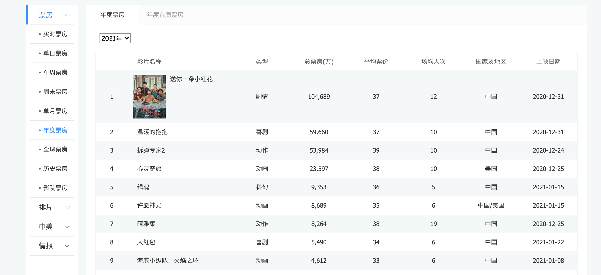

电影票房数据.  在浏览器上看的时候是正常的. 那么按照之前的逻辑. 我们只需要看看数据是通过哪个请求拿到的就可以进行模拟请求了. 但是!

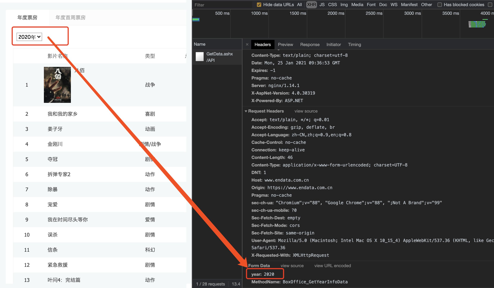

数据找到了. 接着看"预览"吧

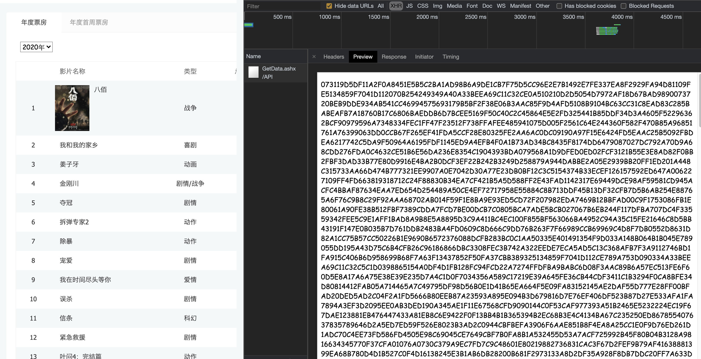

我们发现这个数据是经过加密算法的. 这就头疼了. 直接通过requests拿到这些内容必须要解密才能看到真实数据. 但是该网站采用的加密方式又不是那么容易破解. 此时, 各位想想如果我能通过我的程序直接调用浏览器. 让浏览器去解密这些内容. 我们直接拿结果岂不妙哉. 哎~这就引出了我们本章要重点讲解的selenium了. 它可以完美解决上述问题

简单介绍一下selenium, 它本身是一个自动化测试的工具. 可以启动一个全新的浏览器.并从浏览器中提取到你想要的内容. 随着各种网站的反爬机制的出现. selenium越来越受到各位爬sir的喜爱. selenium最大的缺点其实就一个, 慢! 你想啊. 他要启动一个第三方的软件(浏览器), 并且还要等待浏览器把数据渲染完毕. 这个过程必然是很耗时的. 所以它慢. 

接下来, 我们来聊聊selenium如何安装和使用. 

就像其他第三方库一样, selenium直接用pip就可以安装了

```python
pip install selenium
```

但是呢, 它与其他库不同的地方是他要启动你电脑上的浏览器, 这就需要一个驱动程序来辅助. 

chrome驱动地址:https://npm.taobao.org/mirrors/chromedriver

这里推荐用chrome浏览器. 其他浏览器的驱动请自行百度. 


根据你电脑的不同自行选择吧.  win64选win32即可. 

然后关键的来了. 把你下载的浏览器驱动放在程序所在的文件夹. 或者放到python解释器所在的文件夹. 两种二选其一. 

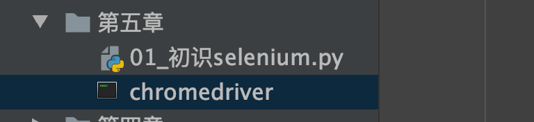

或者

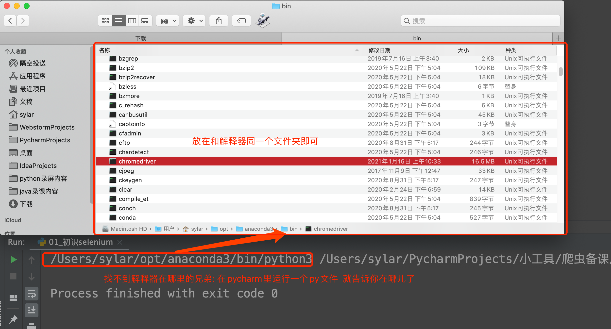

OK~  前期准备工作完毕.  上代码看看, selenium是个什么鬼

```python
from selenium.webdriver import Chrome  # 导入谷歌浏览器的类


# 创建浏览器对象
web = Chrome(executable_path="chromedriver")  # 如果你的浏览器驱动放在了项目里.
# web = Chrome()  # 如果你的浏览器驱动放在了解释器文件夹

web.get("http://www.baidu.com")  # 输入网址
print(web.title)  # 打印title
```

运行一下你会发现神奇的事情发生了. 浏览器自动打开了. 并且输入了网址. 也能拿到网页上的title标题. 

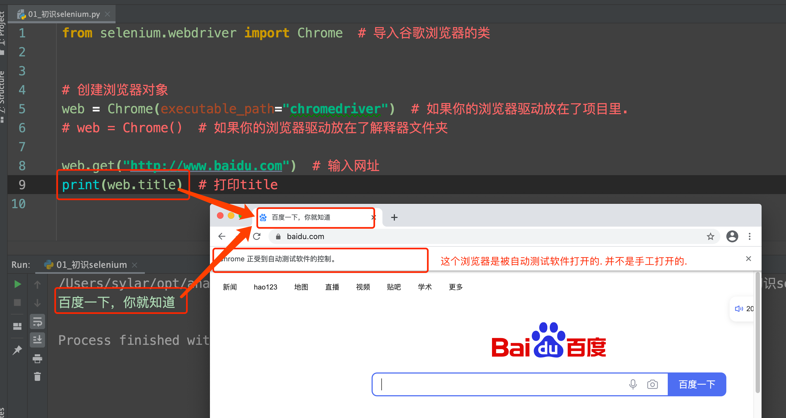

cool~

## 2. selenium各种神奇操作

selenium不但可以打开浏览器. 还可以对浏览器各种操作. 比如, 点击, 查找. 都可以. 

我们直接上案例. 抓取拉钩网招聘python工程师的招聘信息

### 2.1 准备工作

```python
from selenium.webdriver import Chrome

web = Chrome()

web.get("http://lagou.com")

```

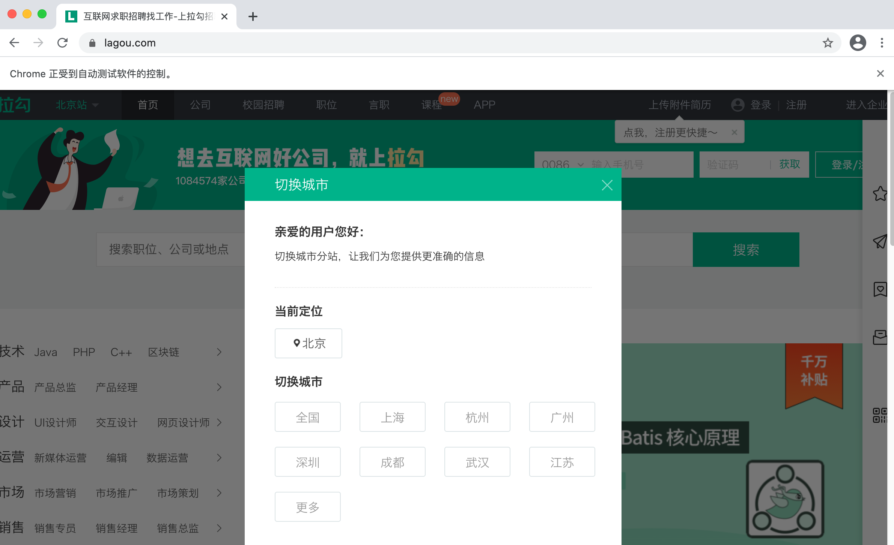


###2.2 点击-全国按钮

想要点击这个按钮. 我们需要先定位到这个按钮. 然后再点击

selenium想要定位某个元素. 太简单了. 

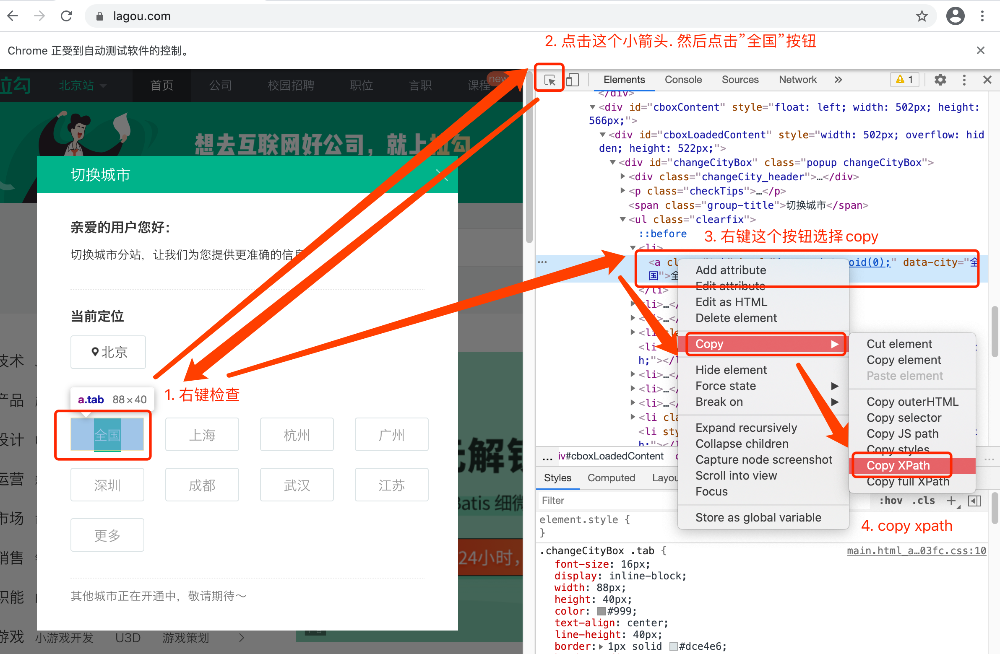

有了xpath是不是明白了些什么. 

```python
from selenium.webdriver import Chrome

web = Chrome()

web.get("http://lagou.com")
btn = web.find_element_by_xpath('//*[@id="changeCityBox"]/ul/li[1]/a')  # 找到全国按钮
btn.click()  # 点击这个按钮

```


舒服!


### 2.3 搜索python

人的过程: 找到文本框输入"python", 点击"搜索"按钮.  

机器的过程: 找到文本框输入"python", 点击"搜索"按钮. 

发现没, 用selenium最爽的地方就是这里. 人是怎么操作的. 机器就怎么操作. 爽到极点

```python
# 找到文本框输入python, 点击搜索按钮
web.find_element_by_xpath('//*[@id="search_input"]').send_keys("python")
web.find_element_by_xpath('//*[@id="search_button"]').click()
```

send_keys() 这里要说一下. 如果我们给出的是一个字符串. 就是输入文本. 但是, 如果给出的是一个键盘指令, 那就按下键盘. 比如, 我想要按回车按钮. 就是这样的

```python
from selenium.webdriver import Chrome
from selenium.webdriver.common.keys import Keys
import time
web = Chrome()

web.get("http://lagou.com")
btn = web.find_element_by_xpath('//*[@id="changeCityBox"]/ul/li[1]/a')  # 找到全国按钮
btn.click()  # 点击这个按钮

time.sleep(2)  # 让浏览器反应一会儿

# 找到文本框输入python, 点击搜索按钮
web.find_element_by_xpath('//*[@id="search_input"]').send_keys("python", Keys.ENTER)
# web.find_element_by_xpath('//*[@id="search_button"]').click()

```

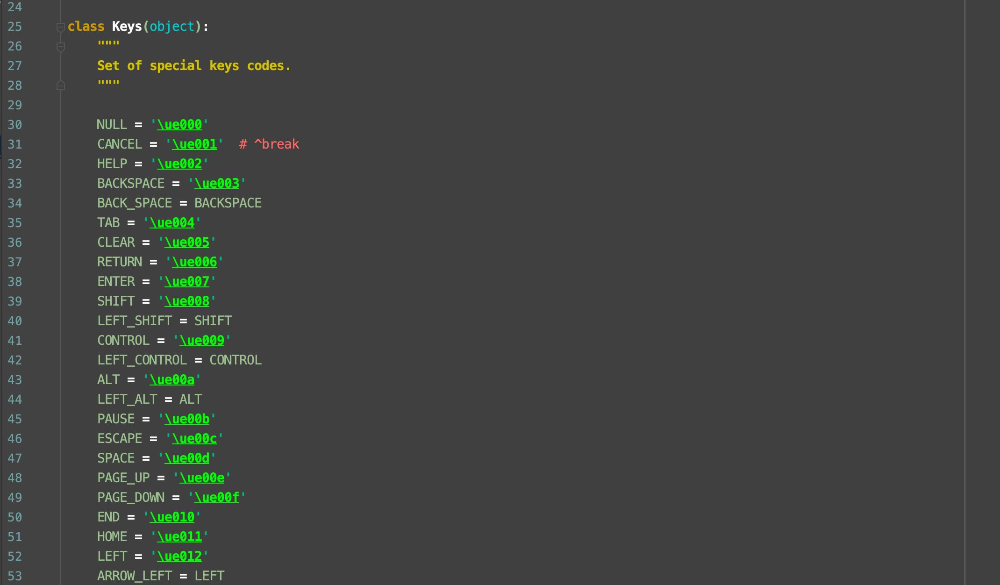

keys里几乎包含了我们需要的所有特殊按键


### 2.4 提取招聘信息

```python
from selenium.webdriver import Chrome
from selenium.webdriver.common.keys import Keys
import time
web = Chrome()

web.get("http://lagou.com")
btn = web.find_element_by_xpath('//*[@id="changeCityBox"]/ul/li[1]/a')  # 找到全国按钮
btn.click()  # 点击这个按钮

time.sleep(2)  # 让浏览器反应一会儿

# 找到文本框输入python, 点击搜索按钮
web.find_element_by_xpath('//*[@id="search_input"]').send_keys("python", Keys.ENTER)
time.sleep(1)
# web.find_element_by_xpath('//*[@id="search_button"]').click()


ls = web.find_elements_by_xpath('//*[@id="s_position_list"]/ul/li')  # 一次性提取多个元素用elements
for item in ls:
    name = item.find_element_by_xpath('./div[1]/div[1]/div[1]/a/h3').text
    addr = item.find_element_by_xpath('./div[1]/div[2]/div[1]/a').text
    print(name, addr)
    # 其他内容你自己琢磨吧

```

发现没有, selenium几乎是傻瓜式的存在. 


##3. 处理iframe, 多窗口调度

我们书接上回. 上回说到我们已经可以通过selenium拿到拉钩网的招聘信息了. 但是, 信息不够全面. 我们希望得到的不仅仅是一个岗位名称和公司名称, 我更想知道更加详细的职位描述以及岗位要求. 

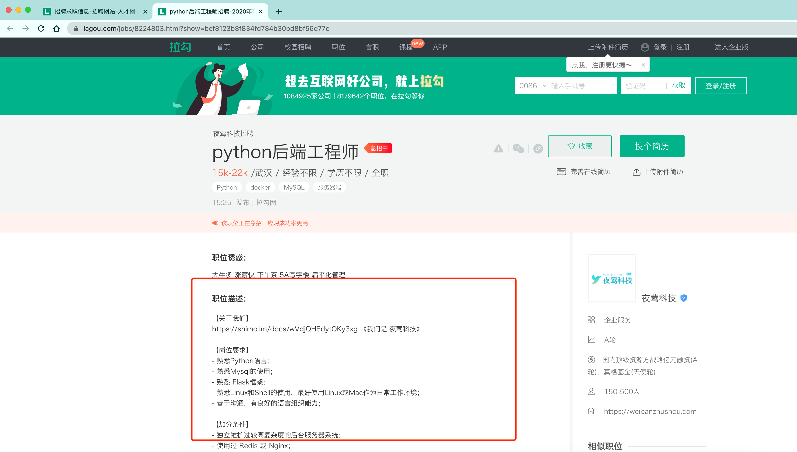

此时问题就来了. 我们可以在搜索页面点击进入到这个详情页. 然后就可以看到想要的职位描述了. 但是, 这时就涉及到如何从一个窗口转向另一个窗口了(切换选项卡).

首先, 我们先通过selenium定位到搜索页上的职位超链接. 

```python
from selenium.webdriver import Chrome
from selenium.webdriver.common.keys import Keys
import time

web = Chrome()
web.get("http://www.lagou.com")

web.find_element_by_xpath('//*[@id="changeCityBox"]/ul/li[1]/a').click()
time.sleep(2)
web.find_element_by_xpath('//*[@id="search_input"]').send_keys("python", Keys.ENTER)
time.sleep(2)
# 不要红包(拉钩的活动. 时有时无)
web.find_element_by_xpath('/html/body/div[8]/div/div[2]').click()
# 点击职位
web.find_element_by_xpath('//*[@id="s_position_list"]/ul/li[1]/div[1]/div[1]/div[1]/a/h3').click()
time.sleep(1)

```

正片开始

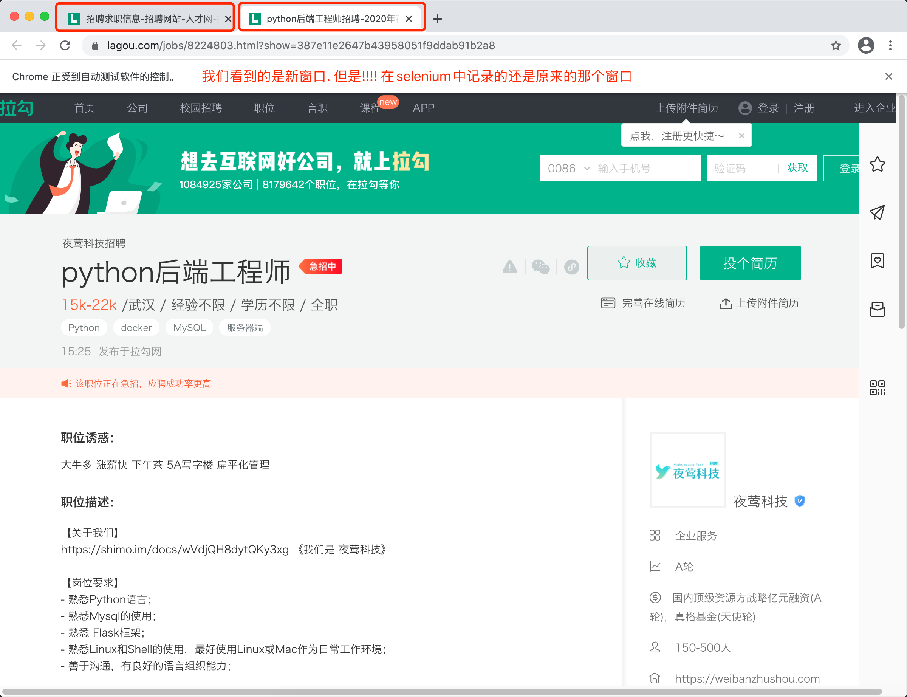

注意!  我们看到的是新窗口的内容, 但是在selenium的视角里, 窗口依然停留在刚才那个窗口. 此时, 必须要将窗口调整到最新的窗口上才可以. 

```python
# 正片开始
web.switch_to.window(web.window_handles[-1])  # 跳转到最后一个窗口
job_detail = web.find_element_by_xpath('//*[@id="job_detail"]/dd[2]').text
print(job_detail)
```


接下来我们来看另一种操作. 

之前我们抓取过一个网站. 里面把视频内容嵌套在一个iframe中. 那如果换成了selenium应该如何应对呢?

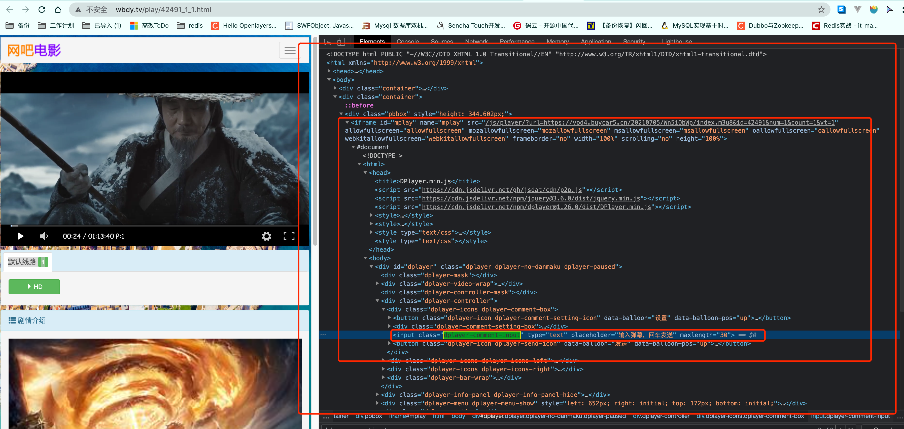

```python
from selenium.webdriver import Chrome

web = Chrome()
web.get("http://www.wbdy.tv/play/42491_1_1.html")

# 找到那个iframe
iframe = web.find_element_by_xpath('//iframe[@id="mplay"]')

web.switch_to.frame(iframe)
val = web.find_element_by_xpath('//input[@class="dplayer-comment-input"]').get_attribute("placeholder")
print(val)

# 调整回上层结构
web.switch_to.parent_frame()
xxx = web.find_element_by_xpath('/html/body/div[2]/div[3]/div[2]/div/div[2]/h2').text
print(xxx)

```


## 4. 无头浏览器

我们已经基本了解了selenium的基本使用了. 但是呢, 不知各位有没有发现, 每次打开浏览器的时间都比较长. 这就比较耗时了. 我们写的是爬虫程序. 目的是数据. 并不是想看网页. 那能不能让浏览器在后台跑呢? 答案是可以的. 

咱直接上案例吧. 拿出最开始我们看到的那个网页. 抓取电影票房. 并且用正常的有浏览器窗口的方式来抓取. 然后再改成后台运行不就好了么

```python
from selenium.webdriver import Chrome
from selenium.webdriver.support.select import Select
from selenium.webdriver.chrome.options import Options


import time


opt = Options()
opt.add_argument("--headless")
opt.add_argument('--disable-gpu')
web = Chrome(options=opt)
web.get('https://www.endata.com.cn/BoxOffice/BO/Year/index.html')


# 切换select
sel = Select(web.find_element_by_xpath('//*[@id="OptionDate"]'))
for i in range(len(sel.options)):
    sel.select_by_index(i)  # 按照索引位置切换
    time.sleep(1)
    table = web.find_element_by_xpath('//*[@id="TableList"]/table')
    print("===========================================")
    print(table.text)
```


## 5. 超级鹰搞定验证码

在进行爬虫抓取的时候遇到验证码怎么办?  这个问题其实一直都很蛋疼. 怎么解决呢? 

1. 自己想办法写一套深度学习算法. 有针对的去学习各种验证码的识别方案
2. 使用互联网上已经相对成熟的产品进行验证码识别. 

理性告诉我, 方案二更适合我.

这里推荐各位可以用超级鹰来做测试. 不同的平台使用的算法可能是不一样的. 但是调用方案几乎都差不太多. 

我们来看看超级鹰怎么用. 首先, 登录超级鹰的官网. 然后需要注册. 注册后, 需要我们进入用户中心. 生成一个新的软件ID就可以用了

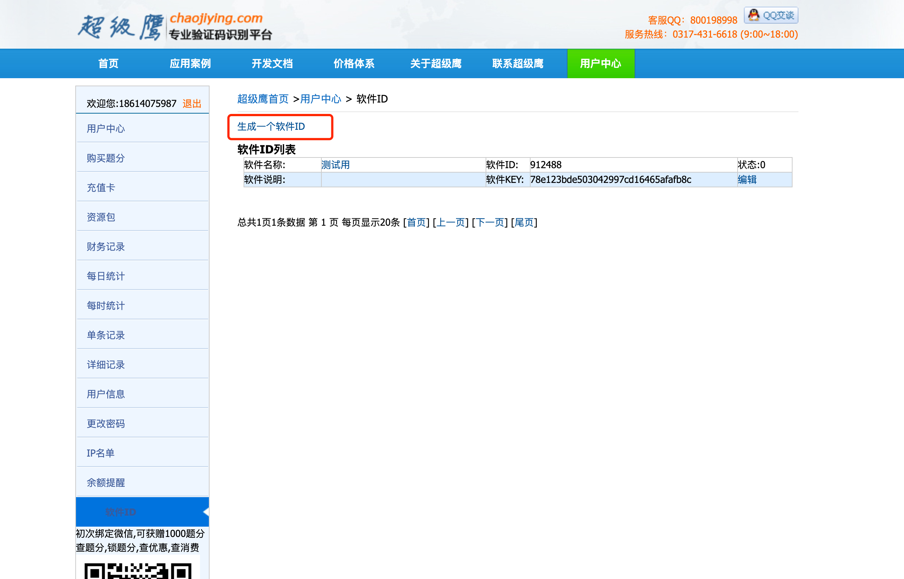

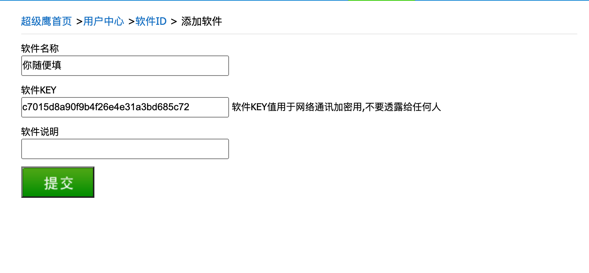

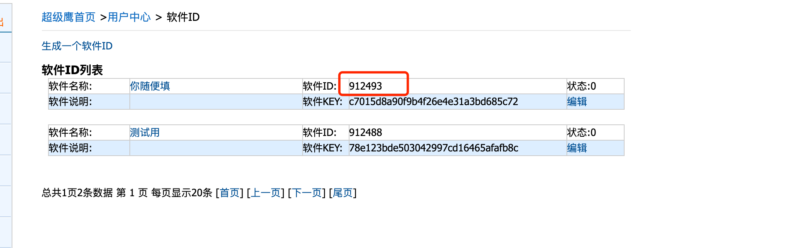

注意这个号, 后面会用到. 

然后我们回到超级鹰的官网. 找到测试代码. 找到python的测试代码, 下载. 丢到pycharm里

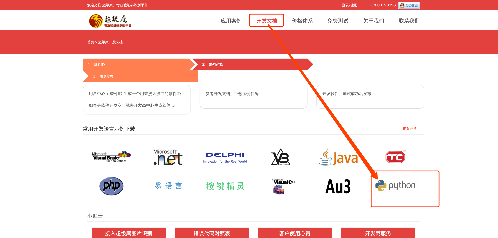

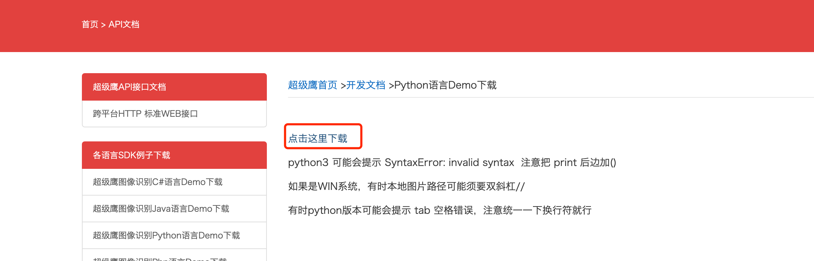

下载好的内容解压. 丢到pycharm中. 

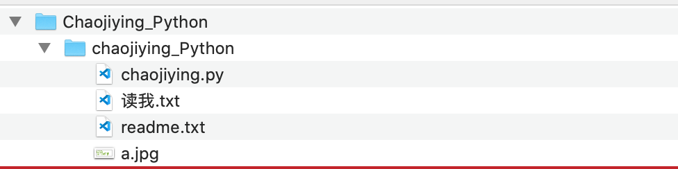

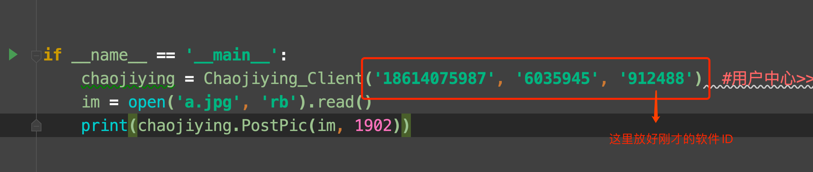

最后, 测试一下

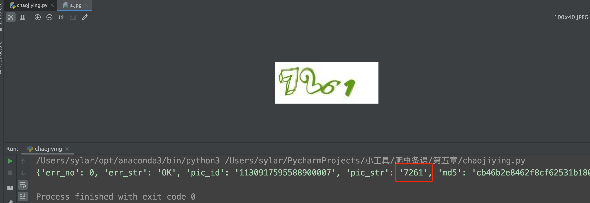

识别效果还是不错的. 

```python
#!/usr/bin/env python
# coding:utf-8

import requests
from hashlib import md5

class Chaojiying_Client(object):

    def __init__(self, username, password, soft_id):
        self.username = username
        password =  password.encode('utf8')
        self.password = md5(password).hexdigest()
        self.soft_id = soft_id
        self.base_params = {
            'user': self.username,
            'pass2': self.password,
            'softid': self.soft_id,
        }
        self.headers = {
            'Connection': 'Keep-Alive',
            'User-Agent': 'Mozilla/4.0 (compatible; MSIE 8.0; Windows NT 5.1; Trident/4.0)',
        }

    def PostPic(self, im, codetype):
        """
        im: 图片字节
        codetype: 题目类型 参考 http://www.chaojiying.com/price.html
        """
        params = {
            'codetype': codetype,
        }
        params.update(self.base_params)
        files = {'userfile': ('ccc.jpg', im)}
        r = requests.post('http://upload.chaojiying.net/Upload/Processing.php', data=params, files=files, headers=self.headers)
        return r.json()

    def ReportError(self, im_id):
        """
        im_id:报错题目的图片ID
        """
        params = {
            'id': im_id,
        }
        params.update(self.base_params)
        r = requests.post('http://upload.chaojiying.net/Upload/ReportError.php', data=params, headers=self.headers)
        return r.json()


if __name__ == '__main__':
    chaojiying = Chaojiying_Client('18614075987', '6035945', '912488')	
    im = open('a.jpg', 'rb').read()							
    print(chaojiying.PostPic(im, 1902))								


```


如果遇到的验证码比较特殊. 可以更换代码中的1902位置的参数值. 具体情况可以参考官网上给出的参数列表

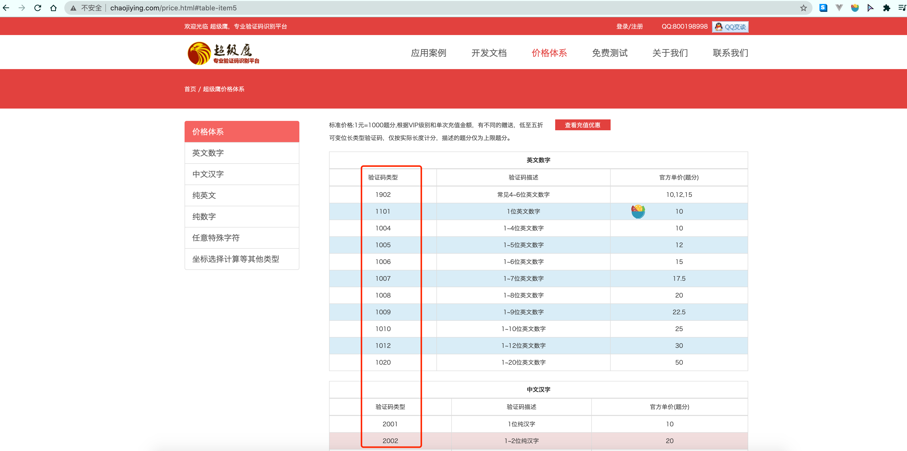

需要哪个填哪个就行. 

各位可以自行做个测试. 用超级鹰来破解超级鹰的登录验证码~~ 相信会很有意思.


## 6. 超级鹰干超级鹰

本小节, 我们用超级鹰来破解超级鹰的验证码. 看看效果如何~

```python
from selenium.webdriver import Chrome
from chaojiying import Chaojiying_Client
import time


web = Chrome()
web.get("http://www.chaojiying.com/user/login/")


code_img = web.find_element_by_xpath('/html/body/div[3]/div/div[3]/div[1]/form/div/img')
png_code_img = code_img.screenshot_as_png  # 拿到img的截图

chaojiying = Chaojiying_Client('18614075987', '6035945', '912488')
result = chaojiying.PostPic(png_code_img, 1902)

web.find_element_by_xpath('/html/body/div[3]/div/div[3]/div[1]/form/p[1]/input').send_keys('18614075987')
web.find_element_by_xpath('/html/body/div[3]/div/div[3]/div[1]/form/p[2]/input').send_keys('6035945')
web.find_element_by_xpath('/html/body/div[3]/div/div[3]/div[1]/form/p[3]/input').send_keys(result['pic_str'])
time.sleep(10)
web.find_element_by_xpath('/html/body/div[3]/div/div[3]/div[1]/form/p[4]/input').click()
```


## 7. 图鉴-好东西


这个东西. 既便宜. 有好用. 比超级鹰爽. 

注册个账号. 如果不想注册. 直接用我的也OK

然后就可以用了. 

官方示例:

```python
import base64
import json
import requests
# 一、图片文字类型(默认 3 数英混合)：
# 1 : 纯数字
# 1001：纯数字2
# 2 : 纯英文
# 1002：纯英文2
# 3 : 数英混合
# 1003：数英混合2
#  4 : 闪动GIF
# 7 : 无感学习(独家)
# 11 : 计算题
# 1005:  快速计算题
# 16 : 汉字
# 32 : 通用文字识别(证件、单据)
# 66:  问答题
# 49 :recaptcha图片识别 参考 https://shimo.im/docs/RPGcTpxdVgkkdQdY
# 二、图片旋转角度类型：
# 29 :  旋转类型
#
# 三、图片坐标点选类型：
# 19 :  1个坐标
# 20 :  3个坐标
# 21 :  3 ~ 5个坐标
# 22 :  5 ~ 8个坐标
# 27 :  1 ~ 4个坐标
# 48 : 轨迹类型
#
# 四、缺口识别
# 18 : 缺口识别（需要2张图 一张目标图一张缺口图）
# 33 : 单缺口识别（返回X轴坐标 只需要1张图）
# 五、拼图识别
# 53：拼图识别
def base64_api(uname, pwd, img, typeid):
    with open(img, 'rb') as f:
        base64_data = base64.b64encode(f.read())
        b64 = base64_data.decode()
    data = {"username": uname, "password": pwd, "typeid": typeid, "image": b64}
    result = json.loads(requests.post("http://api.ttshitu.com/predict", json=data).text)
    if result['success']:
        return result["data"]["result"]
    else:
        return result["message"]
    return ""


if __name__ == "__main__":
    img_path = "换成你自己的图片.jpg"
    result = base64_api(uname='q6035945', pwd='q6035945', img=img_path, typeid=3)
    print(result)
```

非常的简单.  可以自行先爽一下.  下节课我们来使用图鉴, 完成验证码的处理.
