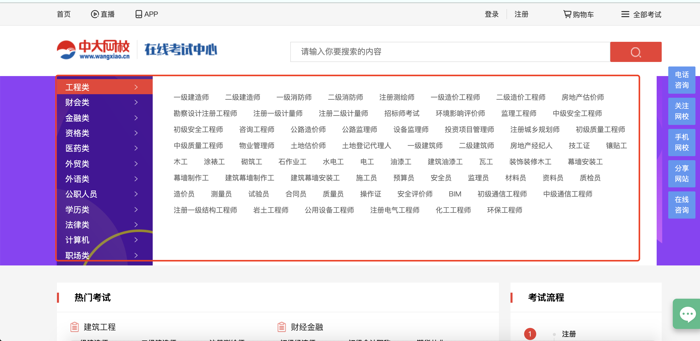
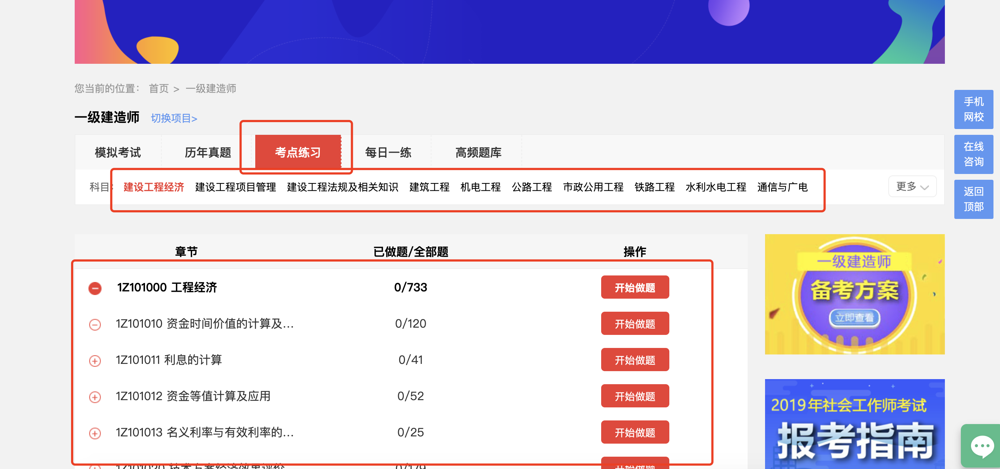
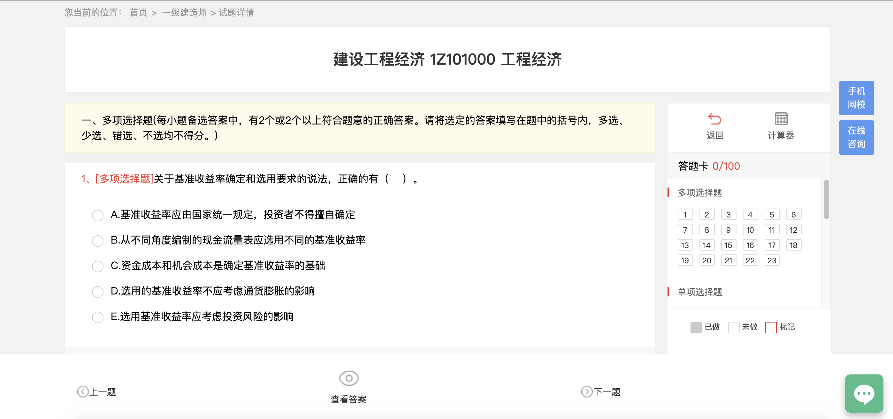

# scrapy实战案例

## splash+scrapy+bloom

在说案例之前, 上一节中我们漏掉了一个知识点. 在我们使用scrapy_splash的时候需要对过滤器进行配置. 

```python
# scrapy_splash
# 渲染服务的url, 这里换成你自己的
SPLASH_URL = 'http://192.168.31.172:8050'
# 下载器中间件, 这个必须要配置
DOWNLOADER_MIDDLEWARES = {
    'scrapy_splash.SplashCookiesMiddleware': 723,
    'scrapy_splash.SplashMiddleware': 725,
    'scrapy.downloadermiddlewares.httpcompression.HttpCompressionMiddleware': 810,
}

# 这个可由可无
# SPIDER_MIDDLEWARES = {
#     'scrapy_splash.SplashDeduplicateArgsMiddleware': 100,
# }
# 去重过滤器, 这个必须要配置
DUPEFILTER_CLASS = 'scrapy_splash.SplashAwareDupeFilter'  # 注意这里
# 使用Splash的Http缓存, 这个必须要配置
HTTPCACHE_STORAGE = 'scrapy_splash.SplashAwareFSCacheStorage'

```

在我们配置scrapy_redis的时候也需要配置该项.

```python
# Configure item pipelines
# See https://docs.scrapy.org/en/latest/topics/item-pipeline.html
ITEM_PIPELINES = {
    'scrapy_redis.pipelines.RedisPipeline': 301,  # 可选项
}
# redis相关配置
REDIS_HOST = "127.0.0.1"
REDIS_PORT = 6379
REDIS_DB = 13
REDIS_PARAMS = {
    "password": "123456",
}

# scrapy_redis相关配置
# scrapy-redis配置信息  # 固定的
SCHEDULER = "scrapy_redis.scheduler.Scheduler"
SCHEDULER_PERSIST = True  # 如果为真. 在关闭时自动保存请求信息, 如果为假, 则不保存请求信息
DUPEFILTER_CLASS = "scrapy_redis.dupefilter.RFPDupeFilter" # 注意这里

```

这两个配置是冲突的. 再加上一个叫布隆过滤器的. 又来一个. 

```python
# 去重类，要使用 BloomFilter 请替换 DUPEFILTER_CLASS
DUPEFILTER_CLASS = "scrapy_redis_bloomfilter.dupefilter.RFPDupeFilter"
# 哈希函数的个数，默认为 6，可以自行修改
BLOOMFILTER_HASH_NUMBER = 6
# BloomFilter 的 bit 参数，默认 30，占用 128MB 空间，去重量级 1 亿
BLOOMFILTER_BIT = 30
```

DUPEFILTER_CLASS = 'scrapy_splash.SplashAwareDupeFilter'

DUPEFILTER_CLASS = "scrapy_redis.dupefilter.RFPDupeFilter"

DUPEFILTER_CLASS = "scrapy_redis_bloomfilter.dupefilter.RFPDupeFilter"

那如果要将三者混合使用该如何是好呢? 

注意, ==这种情况很少见, 我们一般不会这样来使用. 但是如果真的遇到了极端环境. 必须这样做了. 我们需要自己去完成这三个过滤器的整合.==

```python
from scrapy.utils.url import canonicalize_url
from scrapy.utils.request import request_fingerprint
from copy import deepcopy
from scrapy_splash.utils import dict_hash
import logging
import time
from scrapy_redis_bloomfilter.defaults import BLOOMFILTER_HASH_NUMBER, BLOOMFILTER_BIT, DUPEFILTER_DEBUG
from scrapy_redis_bloomfilter import defaults
from scrapy_redis.connection import get_redis_from_settings
from scrapy_redis_bloomfilter.bloomfilter import BloomFilter
from scrapy_redis.dupefilter import RFPDupeFilter as BaseDupeFilter

logger = logging.getLogger(__name__)

def splash_request_fingerprint(request, include_headers=None):
    """ Request fingerprint which takes 'splash' meta key into account """

    fp = request_fingerprint(request, include_headers=include_headers)
    if 'splash' not in request.meta:
        return fp

    splash_options = deepcopy(request.meta['splash'])
    args = splash_options.setdefault('args', {})

    if 'url' in args:
        args['url'] = canonicalize_url(args['url'], keep_fragments=True)

    return dict_hash(splash_options, fp)


class MyDupeFilter(BaseDupeFilter):

    logger = logger

    def __init__(self, server, key, debug, bit, hash_number):
       
        self.server = server
        self.key = key
        self.debug = debug
        self.bit = bit
        self.hash_number = hash_number
        self.logdupes = True
        self.bf = BloomFilter(server, self.key, bit, hash_number)

    @classmethod
    def from_settings(cls, settings):
        server = get_redis_from_settings(settings)
        # XXX: This creates one-time key. needed to support to use this
        # class as standalone dupefilter with scrapy's default scheduler
        # if scrapy passes spider on open() method this wouldn't be needed
        # TODO: Use SCRAPY_JOB env as default and fallback to timestamp.
        key = defaults.DUPEFILTER_KEY % {'timestamp': int(time.time())}
        debug = settings.getbool('DUPEFILTER_DEBUG', DUPEFILTER_DEBUG)
        bit = settings.getint('BLOOMFILTER_BIT', BLOOMFILTER_BIT)
        hash_number = settings.getint('BLOOMFILTER_HASH_NUMBER', BLOOMFILTER_HASH_NUMBER)
        return cls(server, key=key, debug=debug, bit=bit, hash_number=hash_number)

    @classmethod
    def from_crawler(cls, crawler):
        instance = cls.from_settings(crawler.settings)
        return instance

    @classmethod
    def from_spider(cls, spider):
        settings = spider.settings
        server = get_redis_from_settings(settings)
        dupefilter_key = settings.get("SCHEDULER_DUPEFILTER_KEY", defaults.SCHEDULER_DUPEFILTER_KEY)
        key = dupefilter_key % {'spider': spider.name}
        debug = settings.getbool('DUPEFILTER_DEBUG', DUPEFILTER_DEBUG)
        bit = settings.getint('BLOOMFILTER_BIT', BLOOMFILTER_BIT)
        hash_number = settings.getint('BLOOMFILTER_HASH_NUMBER', BLOOMFILTER_HASH_NUMBER)
        print(key, bit, hash_number)
        instance = cls(server, key=key, debug=debug, bit=bit, hash_number=hash_number)
        return instance

    def request_fingerprint(self, request):
        # return request_fingerprint(request)  # 把这个注释掉, 换成下面那个就可以了
        return splash_request_fingerprint(request)

    def request_seen(self, request):
        fp = self.request_fingerprint(request)
        # This returns the number of values added, zero if already exists.
        if self.bf.exists(fp):
            return True
        self.bf.insert(fp)
        return False

    def log(self, request, spider):
        
        if self.debug:
            msg = "Filtered duplicate request: %(request)s"
            self.logger.debug(msg, {'request': request}, extra={'spider': spider})
        elif self.logdupes:
            msg = ("Filtered duplicate request %(request)s"
                   " - no more duplicates will be shown"
                   " (see DUPEFILTER_DEBUG to show all duplicates)")
            self.logger.debug(msg, {'request': request}, extra={'spider': spider})
            self.logdupes = False
        spider.crawler.stats.inc_value('bloomfilter/filtered', spider=spider)


```

上方所有代码全部来自于第三方模块. 我们需要改动的就一个地方. 获取请求信息指纹的时候. 更换成splash_request_fingerprint即可, 代码在`78`行.


## scrapy实战案例

我们用scrapy来完成一个相对复杂的项目, 就当是复习scrapy里面各个功能了.  

==在下节课结束之前, 我希望这个网站还活着. 还能爬!!! 各位手下留情.==

目标网站 http://ks.wangxiao.cn/ 







目标: 抓取到所有分类下, 所有`考点练习`中的练习题. 存储在md中. 

