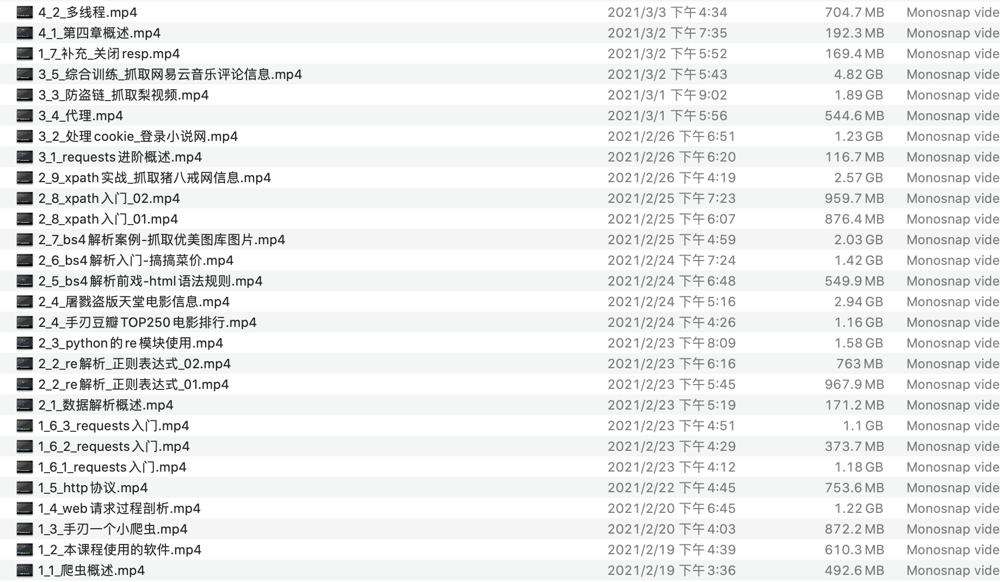
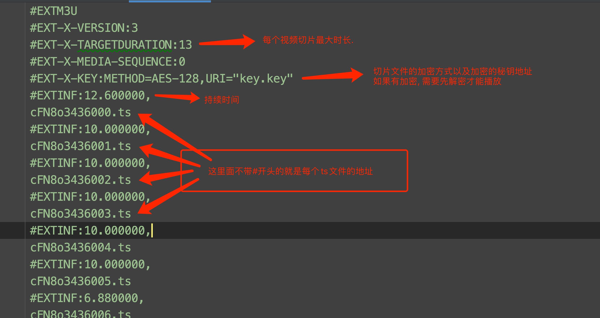
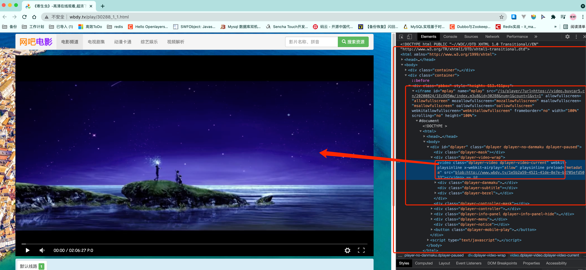
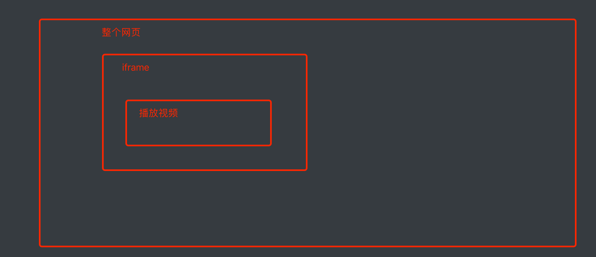
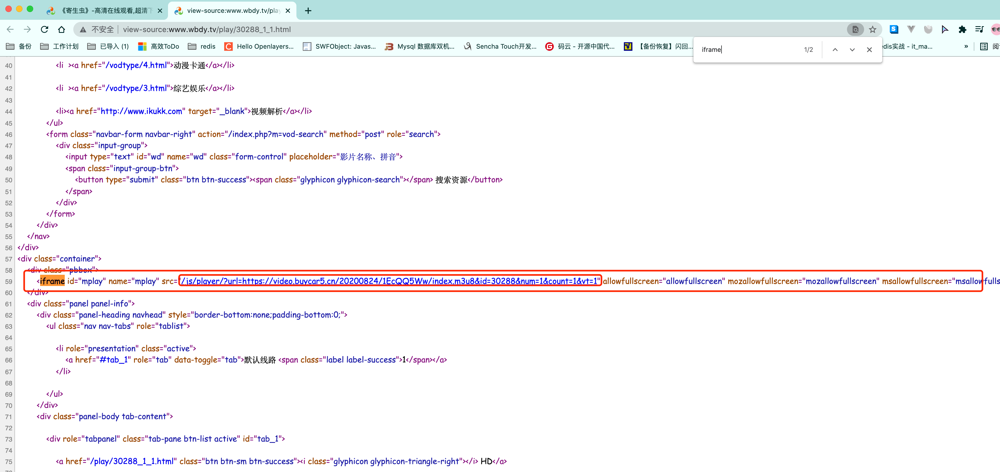
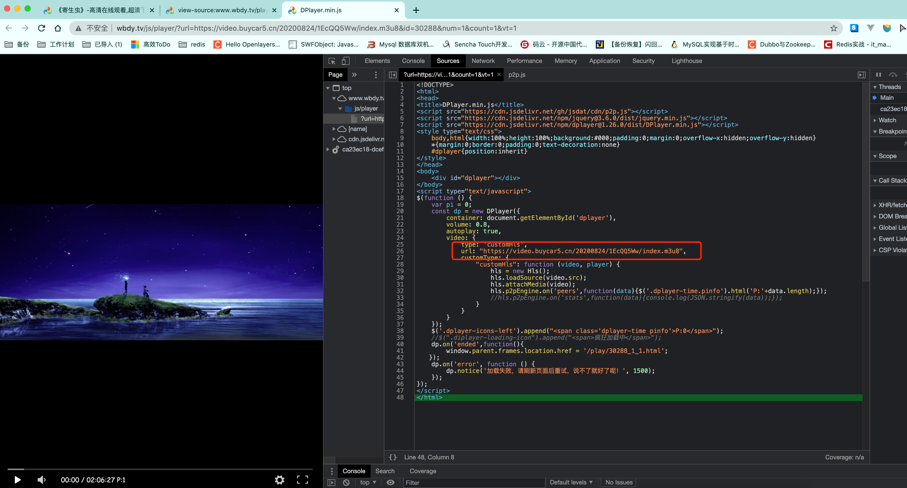
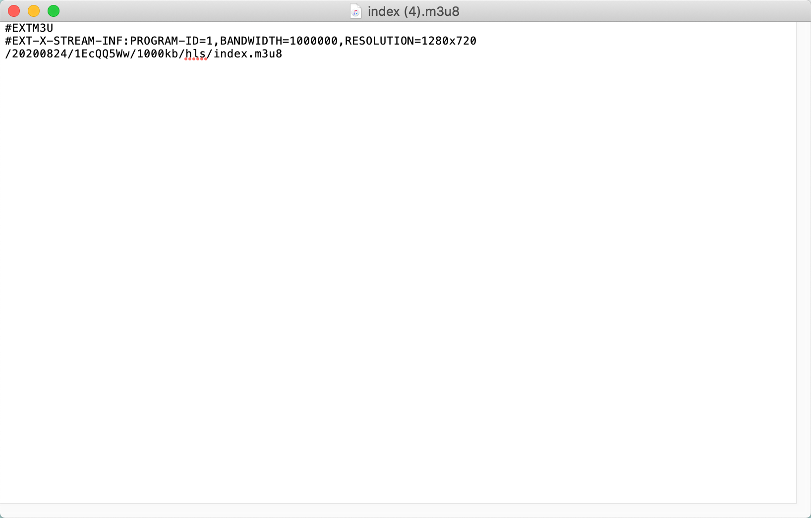
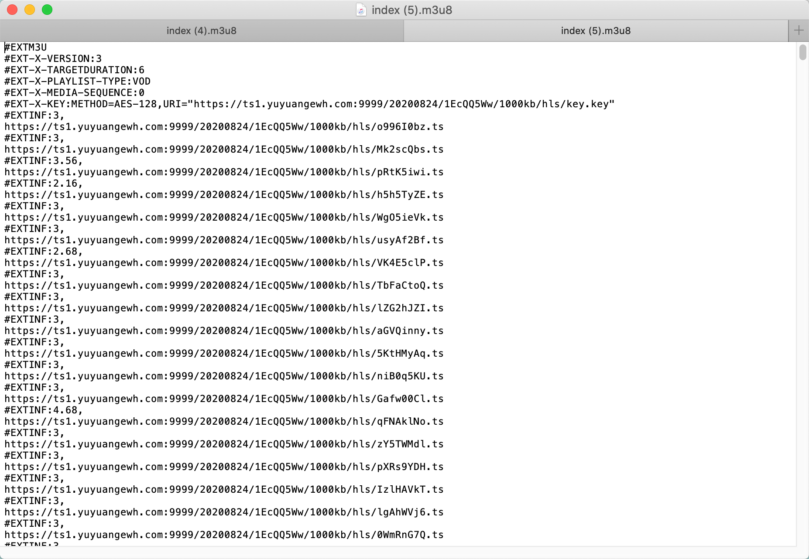

# 利用异步协程抓取一部电影

我们把目光转向wbdy. 目前该案例还是可以用的. 

我们想要抓取网上的视频资源就必须要了解我们的视频网站是如何工作的. 这里我用91看剧来做举例. 其他网站的原理是一样的. 

## 1.视频网站是如何工作的

假设, 你现在想要做一个视频网站. 也有很多的UP猪帮你上传视频. OK, 作为服务器作者的你. 只需要把视频保存起来. 然后给出一个视频的链接即可. 然后在你的HTML代码中通过`video`标签引入即可. 



```html
<video src="1_1_爬虫概述.mp4"></video>
```

就可以了. 但是, 如果你这么做. 你的用户和老板一定会把你骂的狗血临头. 为什么呢?

假设你的视频是10个G的高清无码大资源. 那么此时, 你的用户和你老板将面临如下困境

1. 用户: 这个视频怎么加载的这么慢. 点击快进也快进不了. 太慢了. 塔喵的烦死了. 
2. 老板: 怎么这个月的流量费又这么高啊. 要死的拉好不~

为什么会这样? 聪明的我告诉你答案.  你的视频那么大. 每次用户打开的时候. 可能只是差了最后几分钟没看呢. 那此时它必须把整个视频都传输完毕. 才能看到他想看的那里. 等待时间肯定超长的好不.  而每次都要把10G的文件进行网络传输. 流量费~你懂的. 三大运营商最喜欢的就是你这种朴实无华的送钱行为. 

OK~ 不扯了. 但凡有点儿经验的程序员肯定会想办法把用户上传好的视频进行转码(不同清晰度)做切片(ts)处理. 这样既方便用户进行大跨度的调整进度条(最小延迟). 也能为公司节省大量的流量费. 

既然要把视频切成非常多个小碎片. 那就需要有个文件来记录这些小碎片的路径. 该文件一般为M3U文件. M3U文件中的内容经过UTF-8的编码后, 就是M3U8文件. 今天, 我们看到的各大视频网站平台使用的几乎都是M3U8文件. 

如何解读M3U8文件. 



基本知道这些就够了. 

## 2. 网吧电影网站分析

​		接下来, 我们以网吧电影这个网站中<寄生虫>http://www.wbdy.tv/play/30288_1_1.html作为目标, 先分析一下该网站的视频是如何播放的. 

### 2.1 找到M3U8文件



从图上我们能发现播放视频的video标签是被嵌套在一个叫iframe标签内部的. 而iframe是当前页面中被嵌入的一个小窗口.  嵌套规则如下: 



iframe实际上是HTML语言中的一个标签, 它可以将另一个网页的内容嵌入进来. 也就是说. iframe里面其实是另一个html页面. 

OK, 接下来, 我们去页面源代码中看一看(一定要去页面源代码里看. 不要再F12的elements里看!!!!!!!!!!)



我们发现, 当前网页的页面源代码中是有iframe标签的. 里面的src对应的是另一个url网址. 我们可以点击一下这个网址.


从图上可以看到, 我们之前推到的结构是没问题的. 我们想要看到的视频播放确实放在了这个iframe对应的url里面. 

然后我们再去看看这个iframe里的页面源代码.  注意, 这个页面被视频播放器给填满了. 所以必须去F12的source里看. 



至此, 我们终于找到了该电影所对应的M3U8文件地址了. 

先做一个小总结,  针对网吧电影这个网站而言, 我们想要得到M3U8文件, 过程是: 

1. 访问视频主页的页面源代码. 提取到iframe中的src属性. 暂时记做iframe_url 
2. 提取iframe_url的页面源代码. 提取到M3U8文件的地址

> 注意, 有些网站不是这样的结构, 所以该逻辑未必适用于所有视频网站. 不过一般的网站都大同小异, 只要盯着M3U8即可


### 2.2 M3U8文件解析

我们把刚才的M3U8文件的url地址https://video.buycar5.cn/20200824/1EcQQ5Ww/index.m3u8拿出来. 丢到浏览器里. 会自动开始下载m3u8文件

用记事本打开它, 



里面前两行内容不用管. 第三行里存放的是另一个M3U8文件的地址. 依然是一个url. 我们把这个url和第一次拿到的那个url整合在一起. 继续丢浏览器下载. 



简单解读一下. 前面的内容, 只有EXT-X-KEY有用.  这里面的METHOD=AES-128表示该视频是经过加密的. 需要进行解密. 解密的秘钥存放在URI对应的网址内. 

后面就简单多了. 每一个不以#开头的, 都是视频切片ts文件. 

后期解析起来的整体思路也就出来了. 

1. 下载每一个ts文件

2. 获取到秘钥key

3. 使用AES对ts文件进行解密. 

4. 将众多ts文件合并为MP4文件. 

    

## 3. 代码

```python
import requests
from lxml import etree
import re
from urllib import parse
import asyncio
import aiohttp
import aiofiles
import os
from Crypto.Cipher import AES


def get_page_source(url):
    headers = {
        "Referer": "http://www.wbdy.tv/",
        "User-Agent": "Mozilla/5.0 (Macintosh; Intel Mac OS X 10_15_4) AppleWebKit/537.36 (KHTML, like Gecko) Chrome/91.0.4472.114 Safari/537.36"
    }
    resp = requests.get(url, headers=headers)
    return resp.text


def get_iframe_url(url):
    page_source = get_page_source(url)
    tree = etree.HTML(page_source)
    iframe_src = tree.xpath("//iframe[@id='mplay']/@src")[0]
    movie_name = tree.xpath("//h2/text()")[0]
    return movie_name, iframe_src


def get_m3u8_file_url(iframe_url):
    iframe_source = get_page_source(iframe_url)
    obj = re.compile(r'url: "(?P<m3u8>.*?)",')
    result = obj.search(iframe_source)
    m3u8_url = result.group("m3u8")
    return m3u8_url


async def aio_download_ts(save_path, ts_url, session):
    for c in range(10):
        try:
            async with session.get(ts_url) as resp:
                movie_content = await resp.content.read()
                # 存储文件
                async with aiofiles.open(save_path, mode="wb") as f:
                    await f.write(movie_content)
            print(save_path, "下载完毕!~")
            return ""
        except:
            print(ts_url, "下载失败!~, 重新下载. ")
    return ts_url


async def aio_download(movie_name, ts_list):
    tasks = []

    file_path = f"./{movie_name}"
    if not os.path.exists(file_path):
        os.makedirs(file_path)

    async with aiohttp.ClientSession() as session:
        for ts_url in ts_list:
            file_name = ts_url.split("/")[-1]
            movie_save_path = os.path.join(file_path, file_name)
            tasks.append(asyncio.create_task(aio_download_ts(movie_save_path, ts_url, session)))
        # 启动多任务异步下载
        result, pending = await asyncio.wait(tasks)
        # 如果result里有东西. 那就坏菜了.  这里可以考虑让程序休息一会儿. 然后重新下载. 
        # 或者直接记录在文件里. 等以后再下载. 
        

def get_key(second_m3u8):
    obj = re.compile(r'URI="(?P<key_url>.*?)"')
    result = obj.search(second_m3u8)
    key_url = result.group("key_url")
    return get_page_source(key_url)


async def aio_decrypt_ts(file_path, new_file_path, key):
    async with aiofiles.open(file_path, mode="rb") as f1, \
            aiofiles.open(new_file_path, mode="wb") as f2:

        content = await f1.read()
        aes = AES.new(key.encode("utf-8"), IV=b"0000000000000000", mode=AES.MODE_CBC)
        decrypt_content = aes.decrypt(content)
        await f2.write(decrypt_content)
    print(f"解密成功, 文件被存放在{new_file_path}")


async def aio_decrypt(movie_name, ts_url_list, key):
    file_path_dir = f"./{movie_name}"
    new_file_path_dir = f"./{movie_name}/temp"
    if not os.path.exists(new_file_path_dir):
        os.makedirs(new_file_path_dir)
    tasks = []
    for ts_url in ts_url_list:
        ts_name = ts_url.split("/")[-1]
        file_path = os.path.join(file_path_dir, ts_name)
        new_file_path = os.path.join(new_file_path_dir, ts_name)
        tasks.append(asyncio.create_task(aio_decrypt_ts(file_path, new_file_path, key)))
    result = await asyncio.gather(*tasks)
    return result


def merge(movie_name, ts_url_list):
    new_file_path_dir = f"./{movie_name}/temp"
    # 进入到该文件夹内
    cwd = os.getcwd()
    os.chdir(new_file_path_dir)
    # 合并, 每50个合并为1个.
    part = 1
    last = []
    ts_list = []
    for i in range(len(ts_url_list)):
        ts_url = ts_url_list[i]

        ts_name = ts_url.split("/")[-1]
        ts_list.append(ts_name)

        if i != 0 and i % 50 == 0:
            # "cat  {names} > movie.mp4"
            os.popen(f"cat  {' '.join(ts_list)} > big_movie_{part}.ts")
            last.append(f"big_movie_{part}.ts")
            part += 1
            ts_list = []
    # 最后的最后还剩下一些没有合并呢
    os.popen(f"cat  {' '.join(ts_list)} > big_movie_{part}.ts")
    last.append(f"big_movie_{part}.ts")

    os.popen(f"cat  {' '.join(last)} > movie.mp4")
    os.chdir(cwd)


def parse_m3u8(movie_name, first_m3u8_url):
    print("开始解析M3U8中的ts文件......")
    first_m3u8 = get_page_source(first_m3u8_url)
    second_m3u8_url = ""
    for item in first_m3u8.split():
        if not item.startswith("#"):
            second_m3u8_url = parse.urljoin(first_m3u8_url, item)
            break

    second_m3u8 = get_page_source(second_m3u8_url)
    with open("second_m3u8.txt", mode="w") as f:
        f.write(second_m3u8)
    ts_url_list = []
    for item in second_m3u8.split():
        if not item.startswith("#"):
            # 开始下载
            ts_url_list.append(item)

    print("开始下载M3U8中的ts文件..疯狂下载中.....")
    # 启动协程, 下载ts文件
    asyncio.run(aio_download(movie_name, ts_url_list))
    print("ts文件下载完毕..即将进入解密阶段.....")

    print("开始解密..获取解密秘钥key..")
    key = get_key(second_m3u8)
    print(key)
    # 启动协程, 下载ts文件
    asyncio.run(aio_decrypt(movie_name, ts_url_list, key))
    print("ts文件下载完毕..即将进入合并阶段.....")

    # 合并
    merge(movie_name, ts_url_list)


def main():
    url = "http://www.wbdy.tv/play/30288_1_1.html"
    print(f"开始解析{url}中的m3u8内容....")
    movie_name, iframe_url = get_iframe_url(url)
    iframe_url = parse.urljoin(url, iframe_url)
    first_m3u8_url = get_m3u8_file_url(iframe_url)
    print(f"解析到视频中的m3u8内容....")
    parse_m3u8(movie_name, first_m3u8_url)

    print(f"全部搞定. 接下来. 你可以开始看电影了. ")


if __name__ == '__main__':
    main()

```


